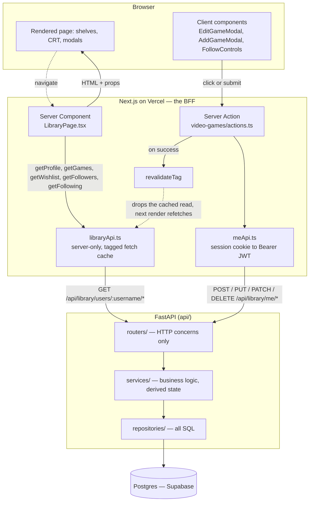

# Architecture

How a request moves through this repo. This is the canonical description of the
request flow: `README.md` and `.claude/CLAUDE.md` link here rather than
restating it, and `api/README.md` owns everything below the router layer (the
backend layer map and the data model).

## The shape in one sentence

The browser never talks to Postgres. Next.js is a
[BFF](https://samnewman.io/patterns/architectural/bff/) that renders pages on
the server and brokers every write, FastAPI is the only thing holding a database
connection, and Supabase supplies Postgres and the auth user store but is not
used as a backend-as-a-service (see
[`docs/supabase-primer.md`](supabase-primer.md) for that argument).

## Request flow

## Read path

Public and cached. `LibraryPage.tsx` is an async Server Component serving both
`/video-games` and `/video-games/u/[username]`; it awaits `getProfile` first (so
an unknown username becomes a 404 rather than a loud API error), then fans the
remaining four reads out through `Promise.all`.

`libraryApi.ts` is the server boundary. It imports `server-only`, so bundling it
into a client component is a build error rather than a leaked API origin. It
also owns origin resolution (`requireLibraryApiOrigin`) and the cache tags.
There is **no fallback data source**: an unresolvable origin throws, which fails
the build for the static library pages instead of shipping an empty shelf.

**The library and wishlist reads also write.** Before building the response,
`services/users.py` hands the catalog rows it just loaded to
`services/catalog_refresh.py`, which re-sources the couple that are most out of
date from IGDB and Wikipedia and stamps them. It is bounded by a row cap and a
wall-clock budget deliberately smaller than `REQUEST_TIMEOUT_MS` in
`libraryApi.ts`, since overrunning that fails the render rather than degrading
it. The rules are in that module; the reason it lives on the read path is that
serving a page is the only regular event this site has.

Two consequences of sitting under the cache, both accepted:

- **A library nobody visits and nobody edits never refreshes**, because nothing
  ever reaches Postgres to notice it has gone stale.
- **A refresh cannot invalidate anyone else's cached page.** Catalog rows are
  shared, so re-sourcing one while serving user A also changes what user B's
  library should say — but the tags are revalidated from `actions.ts`, which
  runs in Next, and the API has no way to reach it. B's page keeps the old
  values until something B does purges the tag. This is the one place the
  "pair every write with its tag" rule in `.claude/CLAUDE.md` cannot be
  followed, rather than an oversight.

Filtering, grouping and sorting happen **client-side**, after the fetch, in
`components/video_games/pipeline.ts` — pure functions over the already-loaded
array, with no React in them. The API returns a whole library and the browser
narrows it.

## Write path

Owner-only and uncached. A client component calls a Server Action in
`app/video-games/actions.ts`; the action calls `meApi.ts`, which exchanges the
Supabase session cookie for a Bearer JWT and hits `/api/library/me/*`; FastAPI
verifies that JWT locally against Supabase's JWKS and enforces
`jwt.sub == row.user_id`. On success the action calls `revalidateTag`, which
drops the cached read so the next render sees the change.

The browser never holds an API token of its own. Adding a read means adding its
tag in `libraryApi.ts` **and** pairing it with every write that can change it in
`actions.ts`; too narrow a tag serves a stale page.

## Cross-cutting notes

- **Play state is derived, never stored.** An open `play_sessions` row (NULL
  `end_date`) is the source of truth for "currently playing"; the newest
  `end_date` is "last played". The service layer collapses raw session rows into
  the five derived fields each `Game` arrives with, so a boolean column can
  never disagree with the sessions.
- **Per-viewer UI resolves after hydration.** Cached payloads carry public data
  only, so owner edit controls, the follow button and the sign-up banner all
  resolve client-side via uncached authenticated calls. Rendering any of it on
  the server would leak one viewer's state into another's cached HTML.
- **`/api/library` is a literal prefix, not a rewrite artifact.** In dev, `next
dev` proxies it to uvicorn on :8000; in production Vercel routes it to the
  Python function. FastAPI routes on the full path either way (`next.config.ts`).
  It is declared once per side: `API_PREFIX` in `api/app/core/config.py`, applied
  at `include_router` time, and `API_PREFIX` in `src/lib/apiPrefix.ts` for the
  callers. The rewrite in `next.config.ts` and the matcher exclusion in
  `src/middleware.ts` have to be kept in step with those by hand.
   
  The second segment exists because `/api` is contested: Vercel routes it to the
  Python function and Next.js claims it for its own Route Handlers, so one
  subtree has to be named as this API's. It names the app, not the runtime: it
  was `/api/py` until 2026-08-18, which leaked an implementation choice clients
  have no business knowing and would have become a lie the day the backend was
  rewritten. Nothing serves the old prefix now. The one trace of the rename left
  is a prerender-only retry in `libraryApi.ts`: a build fetches from the API that
  is currently DEPLOYED, so the build shipping a prefix rename asks a production
  that has not got the new one yet, and failing there fails the build, which
  stops the new API deploying, which fails the next build the same way.
